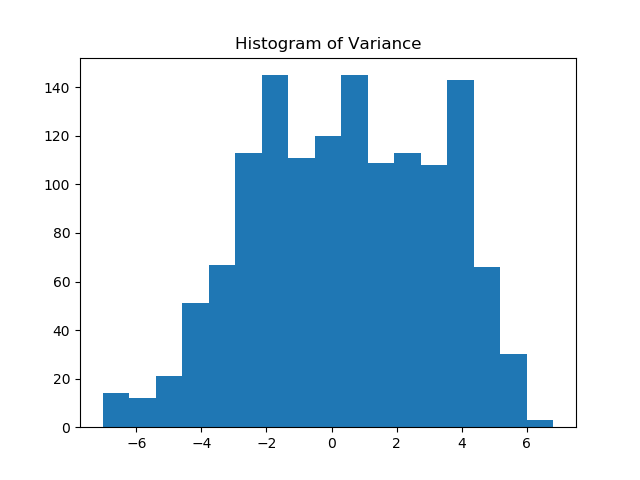

# Python-Banknotes
Here we will be using the UCI Machine Learning Repository Banknotes dataset (https://archive.ics.uci.edu/ml/datasets/banknote+authentication) to showcase some machine learning examples in python.

The goal here is to determine which banknotes are authentic. Therefore, we will be solving a classification problem. We will try several different algorithms and compare the results.

## Examining our variables

It's hard to stray away from my statistics background, so I always like to first visually examine some of the variables that I'll be using. We make one for each one of our predictor variables.


## Code

We have quite a few packages/libaries to import here. Note that we are separating out scikit learn, so that it is clear exactly what we are using here.

```python
from sklearn.model_selection import train_test_split
from sklearn import tree
from sklearn.discriminant_analysis import LinearDiscriminantAnalysis
from sklearn.ensemble import GradientBoostingClassifier
from sklearn import svm
from sklearn.linear_model import LogisticRegression
import pandas as pd
import scipy as sy
import os
import matplotlib.pyplot as plt
```

Next, we'll want to set up our working directory.

```python
os.chdir('python/Python-Banknotes')
```

We are then going to read in data that we have loaded from the UCI Machine Learning Repository (https://archive.ics.uci.edu/ml/datasets/banknote+authentication). Personally, I've had a lot of experience using R, so I chose to use Pandas to read in the data. We then need to convert that pandas data frame into a matrix and an array, for the *X* and *y* respectively.


```python
# read in banknote authentication set
banknotes = pd.read_csv('data/data_banknote_authentication.txt', names=['variance', 'skewness', 'curtosis', 'entropy', 'class'], header=0)

# convert to array
X = banknotes[['variance', 'skewness', 'curtosis', 'entropy']].as_matrix()
y = banknotes[['class']].as_matrix()[:,0]
```

Now that we have read in some data, we will take a look at the distribution of our variables. Let 

## Histograms

### Variance


```python
# Variance
plt.hist(X[:,0], bins='auto')
plt.title('Histogram of Variance')
plt.savefig('plots/variance-histogram.png')
plt.close()
```

### Skewness


```python
# Skewness
plt.hist(X[:,1], bins='auto')
plt.title('Histogram of Skewness')
plt.savefig('plots/skewness-histogram.png')
plt.close()
```

### Curtosis


```python
# Curtosis
plt.hist(X[:,2], bins='auto')
plt.title('Histogram of Curtosis')
plt.savefig('plots/curtosis-histogram.png')
plt.close()
```

### Entropy


```
# Entropy
plt.hist(X[:,3], bins='auto')
plt.title('Histogram of Entropy')
plt.savefig('plots/entropy-histogram.png')
plt.close()
```